# Hướng dẫn sử dụng API

## **Các API liên quan đến đăng nhập, đăng ký**

### Đăng ký, sử dụng phương thức POST
```url
localhost:PORT/api/v1/signup
```
Ví dụ:

### Đăng nhập, sử dụng phương thức POST
```url
localhost:PORT/api/v1/login
```
Ví dụ:

### Quên mật khẩu, sử dụng phương thức POST
```url
localhost:PORT/api/v1/forgotPassword
```
Ví dụ:

### Đặt lại mật khẩu, sử dụng phương thức PATCH
```url
localhost:PORT/api/v1/resetPassword/:token
```
Ví dụ:

## **Các API liên quan đến quiz**
### Lấy danh sách tất cả các quiz, sử dụng phương thức GET
```url
localhost:PORT/api/v1/quizes
```
Ví dụ:
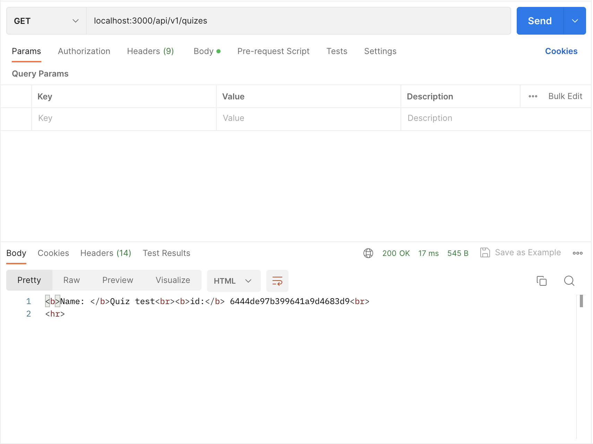

### Tạo một quiz, sử dụng phương thức POST
```url
localhost:PORT/api/v1/quizes
```
Ví dụ:
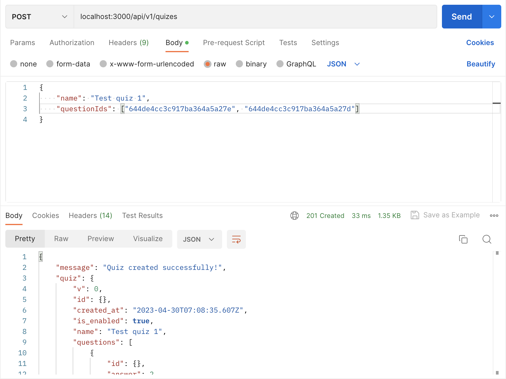
------------------------


### Lấy quiz với với ID là quizID, sử dụng phương thức GET
```url
localhost:PORT/api/v1/quizes/:quizId
```
Ví dụ:
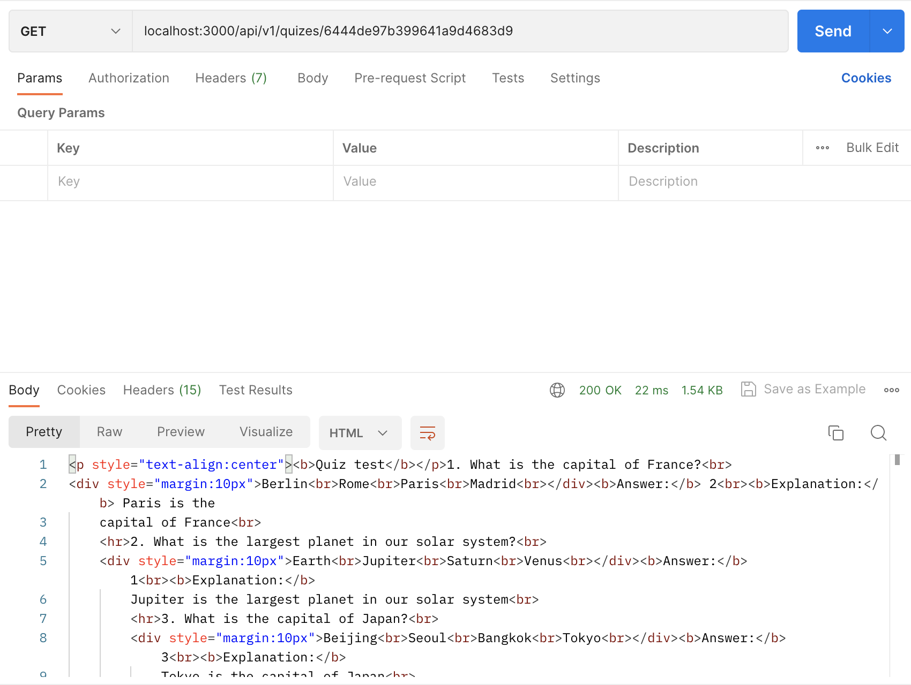

### Cập nhật thông tin của quiz với ID là quizID như tên quiz, câu hỏi trong quiz, sử dụng phương thức PUT

```url
localhost:PORT/api/v1/quizes/:quizId
```
Ví dụ:
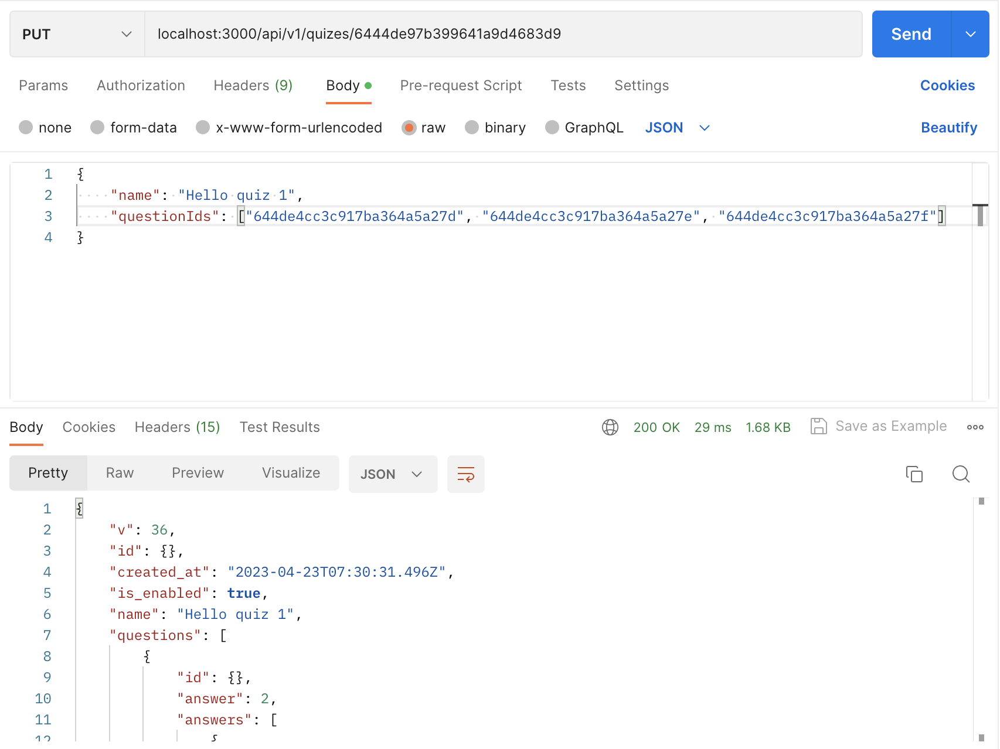
### Xóa quiz với ID là quizID, sử dụng phương thức DELETE
```url
localhost:PORT/api/v1/quizes/:quizId
```
Ví dụ:
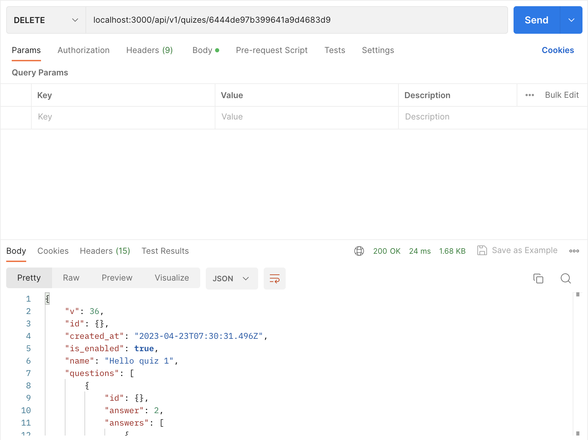
---

### Lấy câu hỏi của quiz với ID là quizID, sử dụng phương thức GET
```url
localhost:PORT/api/v1/quizes/:quizId/questions
```
Ví dụ:
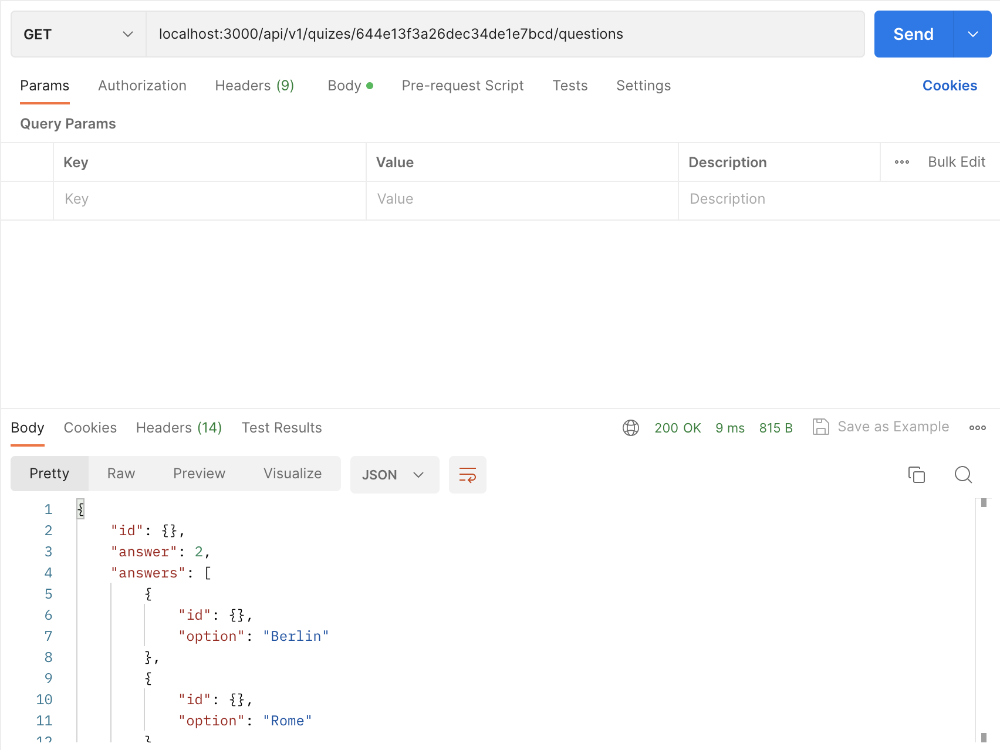

### Thêm câu hỏi của quiz với ID là quizID, sử dụng phương thức POST
```url
localhost:PORT/api/v1/quizes/:quizId/questions
```
Ví dụ:
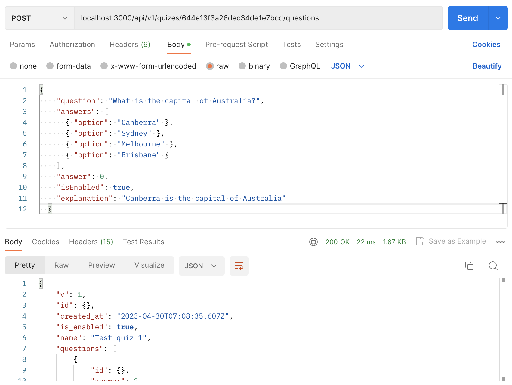
### Xóa toàn bộ câu hỏi của quiz với ID là quizID, sử dụng phương thức DELETE
```url
localhost:PORT/api/v1/quizes/:quizId/questions
```
Ví dụ:
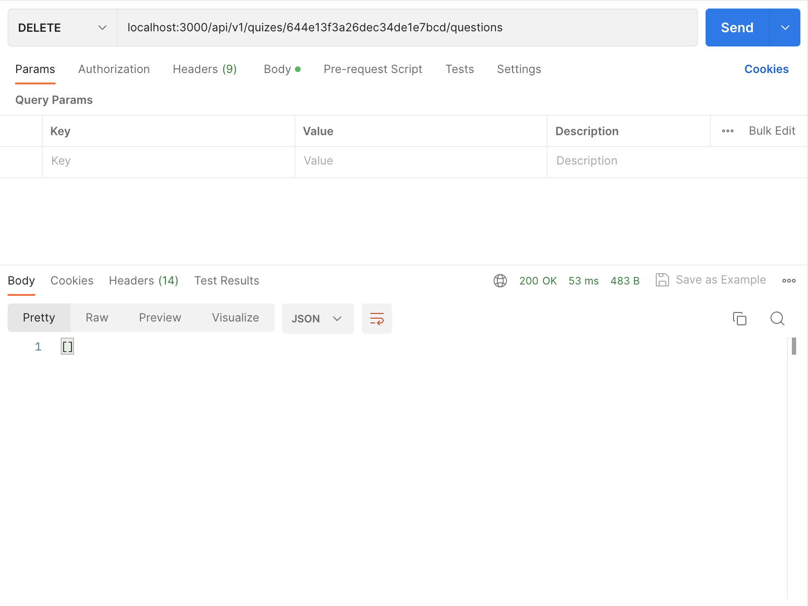
---

### Lấy câu hỏi với ID là questionID của quiz của ID là quizID, sử dụng phương thức GET
```url
localhost:PORT/api/v1/quizes/:quizId/questions/:questionId
```
Ví dụ:
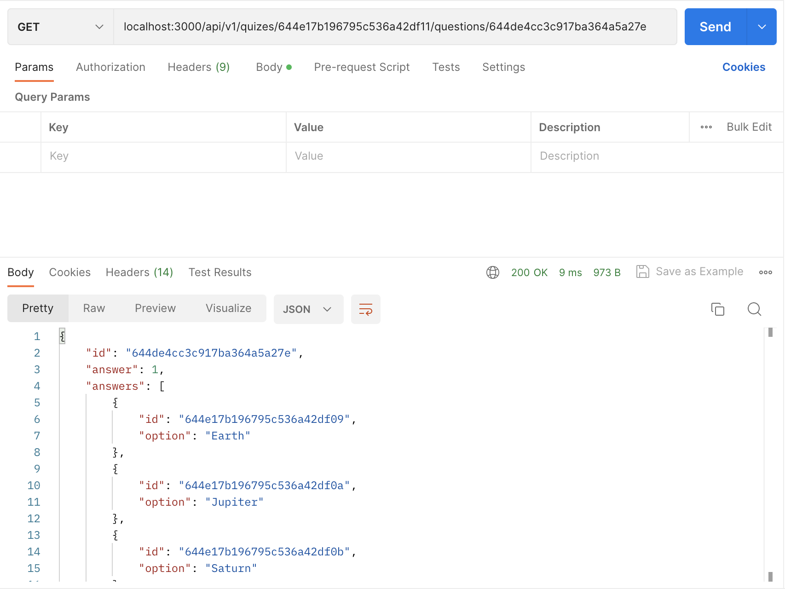

### Cập nhật câu hỏi với ID là questionID của quiz của ID là quizID, sử dụng phương thức PUT
```url
localhost:PORT/api/v1/quizes/:quizId/questions/:questionId
```
Ví dụ:
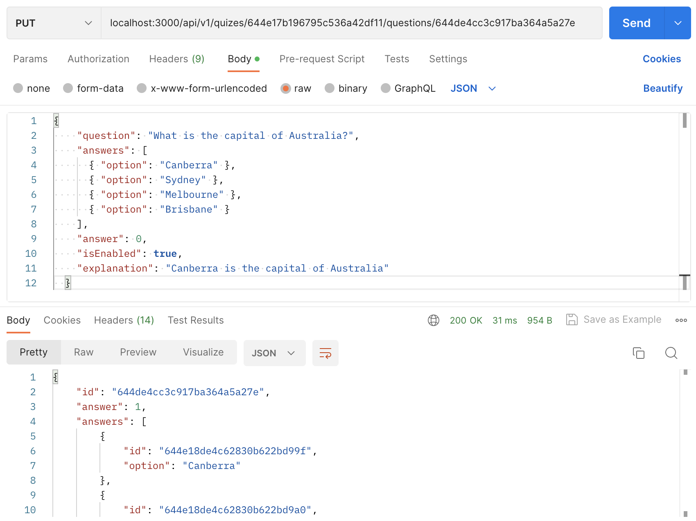

### Xóa câu hỏi với ID là questionID của quiz của ID là quizID, sử dụng phương thức DELETE
```url
localhost:PORT/api/v1/quizes/:quizId/questions/:questionId
```
Ví dụ:
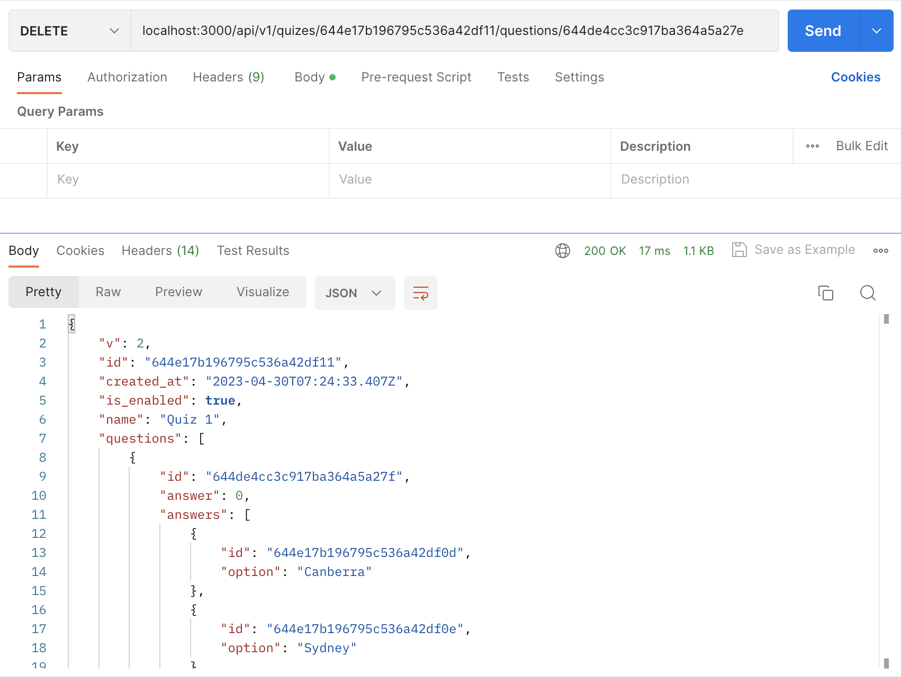